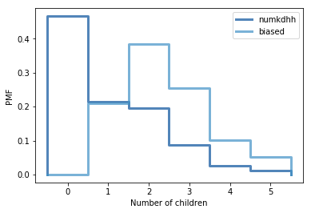

I will be primarily using the modules provided by the author of ThinkStats2 to maintain consistency.<br>
The modules and data needed for this exercise are included in the same directory as this file.


```python
from __future__ import print_function, division

%matplotlib inline

import numpy as np

import nsfg
import first
import thinkstats2
import thinkplot
```

In this question, we are asked to produce a bias probably mass function from some given data. <br>
Then, we have to plot both the unbiased and biased mass functions on the same graph. <br>
We first read in the data.


```python
resp = nsfg.ReadFemResp()
```

We first graph the probablity mass function of the data to confirm if our data matches that used by the author by comparing plots. It does indeed match.


```python
pmf = thinkstats2.Pmf(resp.numkdhh, label='numkdhh')
thinkplot.Pmf(pmf)
thinkplot.Config(xlabel='Number of children', ylabel='PMF')
```


We define a helper function called BiasPmf that helps us produce the biased probability mass function. <br>
Essentially, each item in the distribution is weighted by the frequency at which they appear at. 


```python
def BiasPmf(pmf, label):
    new_pmf = pmf.Copy(label=label)

    for x, p in pmf.Items():
        new_pmf.Mult(x, x)
        
    new_pmf.Normalize()
    return new_pmf
```

We call the helper function BiasPmf on pmf, and plot both probability mass functions on the same graph to compare.


```python
biased = BiasPmf(pmf, label='biased')
thinkplot.PrePlot(2)
thinkplot.Pmfs([pmf, biased])
thinkplot.Config(xlabel='Number of children', ylabel='PMF')
```





To further visualize the impact weighting has on the mean, we compared the unbiased mean with the biased mean.


```python
print('Unbiased Mean: ' + str(pmf.Mean()) + '\n' + 'Biased Mean: ' + str(biased.Mean()))
```

    Regular Mean: 1.024205155043831
    Biased Mean: 2.403679100664282


```python

```
