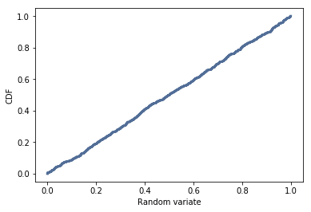

I will be primarily using the modules provided by the author of ThinkStats2 to maintain consistency.<br>
The modules and data needed for this exercise are included in the same directory as this file.


```python
from __future__ import print_function, division

%matplotlib inline

import numpy as np

import nsfg
import first
import thinkstats2
import thinkplot
```

In this exercise, we are asked to generate 1000 random numbers from 0 to 1 using numpy.random.random. <br>
In theory, the probably mass function should be a uniform distribution sinc every value should have the same probability of occurring. <br>


```python
sample = np.random.random(1000)
```

The plot resembles a bar code. Some strips seem darker than others. <br> 
This suggests that some of the random numbers between 0 and 1 are closer to some than others. <br>
In turn, we might be led to believe this not a truly random sample.


```python
pmf = thinkstats2.Pmf(sample)
thinkplot.Pmf(pmf, linewidth=0.1)
thinkplot.Config(xlabel='Random variate', ylabel='PMF')
```


However, if we plot the cumulative density function, we see an almost perfect linear line. <br>
This strongly indicates that the sample is indeed random.


```python
cdf = thinkstats2.Cdf(sample)
thinkplot.Cdf(cdf)
thinkplot.Config(xlabel='Random variate', ylabel='CDF')
```





```python

```
